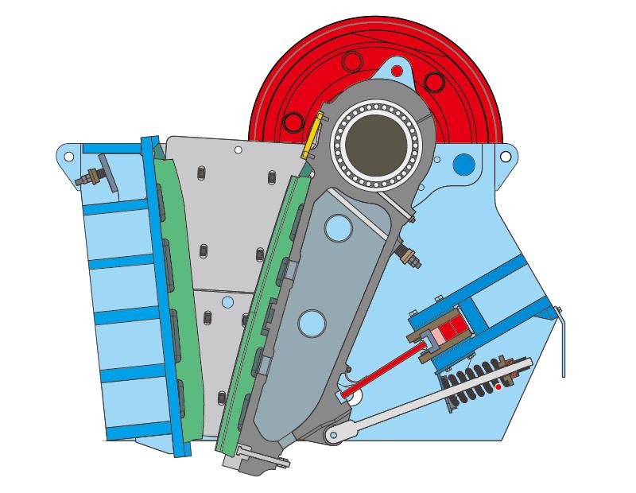

Jaw crusher is one of the important crushing equipment in mining industry. It has the incomparable advantage of stable and reliable operation, easy maintenance, long service life, less dust and noise. Eccentric shaft, the main drive part plays an important role in the operation process. However, during daily production process, due to the overload operation of jaw crusher, the hardness of crushed material and the quality of toggle plate is not up to the standard, the eccentric shaft of jaw crusher is easy to be broken.

1. The main part of jaw crusher tilts during lifting process, the eccentric shaft is bent unilaterally.
2. The hardness of crushed materials exceeds the specified standard, which cause the shaft breaking.
3. The long time overload operation of jaw crusher makes eccentric shaft breaking.
4. If the quality of toggle plate does not meet the standard, when the non-crushed materials enter into the crushing cavity, it will cause the eccentric shaft break for the reason of self-breaking protection.