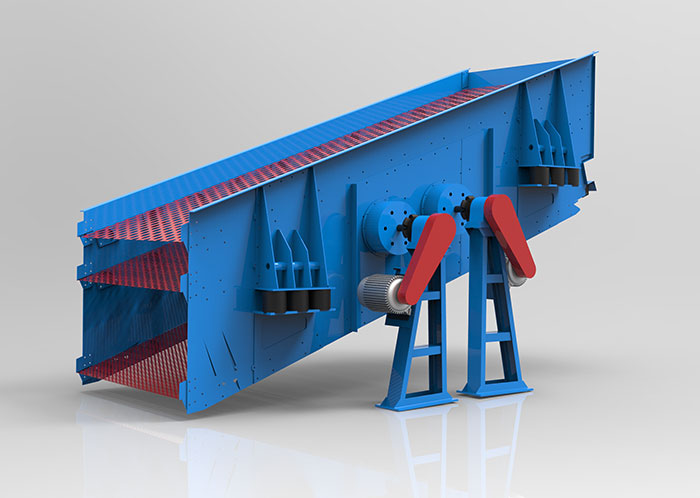

In the production operation of the vibrating screen, due to various reasons, the screen box is cracked, the beam breaks and other failures, which have serious impact on production, and even cannot be produced normally, causing huge losses to the production enterprises.

1. If the production load is too large, the equipment will be overloaded, and the screen box will be cracked and the beam will break.  
  The material has high viscosity, high content of difficult sieve particles, serious clogging of the screen, etc. The material is difficult to be sieved, so that a thick layer is formed on the sieve surface, so that the upper layer material has a suitable particle size and cannot be sieved, and the actual load exceeds. The rated load of the equipment causes a malfunction.  
  Treatment method: The inclination angle of the vibrating screen can be appropriately increased, the sliding speed under the screen surface can be increased, the feeding amount can be reduced, and the screen mesh can be cleaned and replaced.
2. Parts in the screen box such as the screen are loosened for various reasons and resonate with the vibrating screen, causing cracking failure.  
  In actual production, due to the poor working environment, the screen plate will be loose and the screen material will be plastically deformed. After running for a period of time, the screen slack produces relative vibration with the vibrating screen steel beam. When the relative vibration vibrates with the vibration of the vibrating screen itself, it will pose a great threat to the screen box and the beam.  
  Treatment method: When installing the screen, the screen should be tensioned. Regularly check that the screen tension bolts and bead bolts are not loose, and the rubber strips should be replaced in time.
3. Failure to strictly follow the specifications, resulting in equipment cracking  
  Welding on the screen box is strictly forbidden, but the phenomenon of welding and extending the hopper often occurs due to site, process and other reasons. Welding on the side plates causes stress concentration at the weld, which is the main cause of cracking of the side plates.  
  Treatment method: Standard construction, avoids welding on the side plate when welding the extension hopper, and do not excessively increase the length and weight of the discharge hopper.