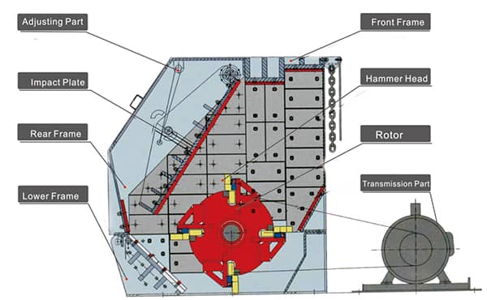
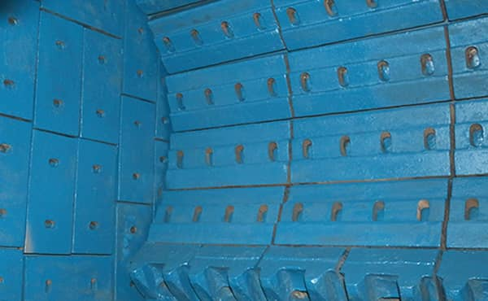

Impact crusher is used to deal with materials with side length less than 100 ~ 500mm, and its compressive strength is up to 350Mpa. The main parts of impact crusher include impact plate, adjusting device, rotor, box body, hammer and driving device. Here, we introduce the main parts of impact crusher.

1. Impact plate: Impact plate is to bear the impacting force generating from the material striking, and then rebound the materials back to crushing area for next crushing. The shape and structure of impact plate have great influence on the crushing efficiency. Impact crusher mainly has folding-shaped and arc-shaped plate. Impact plate is currently using high manganese steel and other wear resistance material.

2. Adjusting device: The adjusting device of impact crusher is also as overload protection device for the whole machine. When foreign matter (such as iron, etc.) or unbreakable matter enters the crusher, the impact plate can automatically back up and spring up, allowing foreign matter to pass through the crusher, preventing foreign matter or unbreakable matter from damaging the equipment. Impact plate adjustment systems are often hydraulic or nut adjustment.
3. Rotor: The rotor structure of impact crusher has three types: integral type, combination type and welding type. The rotor of the crusher mostly adopts the integral cast steel structure, this kind of rotor has a large moment of inertia, strong and durable, easy to put the plate hammer, can meet the needs of crushing work. Small impact crusher can also be used for welding structure, this kind of rotor manufacturing convenience, easy to get the balance, but the strength and durability is poor.

4. Box body: Impact crusher frame is divided into three separate structure, with iron plate and shaped steel welding, in the inner wall of the body is made of steel plate. The left and right sides of the body are equipped with small doors to facilitate maintenance and replacement of wear-resistant parts.
5. Hammer: The hammer is fixed on the rotor, it is an important part of the crusher, the shape of hammer is closely related to the way of fastening and working load. The design of plate hammer should meet the requirements of reliable operation, simple loading and unloading and improving the metal utilization rate of plate hammer. The plate hammer is generally made of high Cr cast iron, high-manganese steel and other wear-resisting alloy steel.
6. Driving device: The driving system adopts the mode of motor, v-belt and crusher, which can effectively improve the motor starting performance and make the motor start and run smoothly. Belt transmission mode can play double overload protection function, drive the motor power required by the system is low, greatly reduce the operating cost.