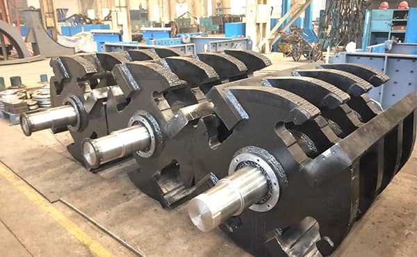

Impact crusher is a kind of new and high efficiency crushing equipment, which combined with the crushing method of shearing, striking, grinding, impacting and centrifugal impaction to effectively and fully utilize the power and crushing cavity, so it has the important position among the crushers.

During working process, the crushing efficiency of impact crusher will be reduced by various factors. Such as rotation speed and rotational inertia of rotor, and the angle of impacting plate. Following, We will analyze the influence of these factors on the crushing effect of impact crusher.

1. Rotor speed. The rotor speed of impact crusher can guide the crusher to break the materials according to the different particle size and different texture, so as to select the proper speed to avoid the phenomenon of over crushing and helpful to reduce the power consumption. The higher the rotation speed, the larger the striking force between the hammer plate and materials. With the increasement of rotor speed, the impacting force between materials and impacting plate become higher and the crushing effect is better.
2. Rotational inertia. In the case of the same speed of rotor, the crushing force provided by the rotor with different rotational inertia is different. The higher the rotational inertia, the larger the impacting force of hammer plate on the materials, and the smaller the reacting force of following impacting plate, the more easier the materials will be crushed.
3. Angle of impacting plate. The crushing effect caused the angle of each impacting plate is of great importance. The angle of first impacting plate affects the sharing and crushing effect, the secondary and tertiary plate have the same crushing effect for the materials.