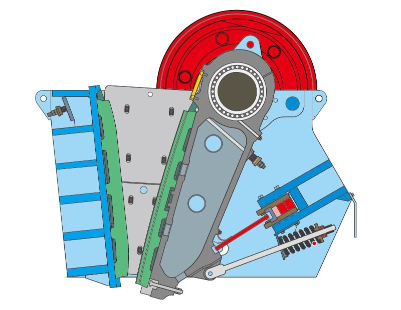

Jaw crusher is used to crush large block of rock into small pieces. According to the different motion trail of swing jaw, the jaw crusher can be divided into simple pendulum jaw crusher and compound pendulum jaw crusher. We only understand the advantages and disadvantages of these two types of crushers, can select the right crusher equipment.

Advantages and Disadvantages of Simple Pendulum Jaw Crusher
-----------------------------------------------------------

Jaw crusher is used for medium and coarse crushing of hardness and medium hardness materials, such as limestone, sandstone, dolomite, quartz, feldspar, gypsum, fluorite, clinker and coarse coal, etc.

**The advantage of simple pendulum jaw crusher:** Simple and strong structure, reliable and safety operation, easy maintenance, low installation height, wide material processing scope up to 1m. The crushing force is not forced directly on the eccentric shaft, which is helpful to the eccentric shaft and bearing, so it can be made into large type.

**The disadvantage of simple pendulum jaw crusher:** Swing jaw has idle stroke, low production efficiency. The bottom horizontal stroke is large than that of upper, which does not match the crushing process. It makes uneven load on the jaw plate and uneven abrasion of liner plate, which forms clearance when the jaw plate moves up and down, it also reduces production efficiency. The rectangle discharge opening is easy to produce sheet products that bad for the next crushing. It is not suitable for crushing wet and viscosity materials which are easy to block crushing cavity. Because of the movement of heavy connecting rod and swing jaw, the big inertial moment makes the large type jaw crusher difficult to start and has high requirement on installation foundation.

Advantage and Disadvantage of Compound Pendulum Jaw Crusher
-----------------------------------------------------------

The complex pendulum jaw crusher is mainly used for the medium and fine crushing of medium hard materials or toughness and viscosity materials. The swing jaw is directly hanged on the eccentric shaft, so there is no need to use the joint-rod or two pushing plate, one is enough. The motion trail of swing jaw is a complex curve, the upper trail that hangs on the shaft is a circle, the bottom trail that connected with push plate is an arc, and the middle part is ellipse with different length of shaft. So it is called complex pendulum jaw crusher.

The advantage of complex pendulum jaw crusher: The upper horizontal stroke is longer than that of bottom which is suitable for crushing. Materials receive the force from squeezing, bending, splitting and grinding reducing the flake products. The vertical movement of swing jaw promotes materials discharge, and enhances productivity. The production capacity improves 20-30% of the simple pendulum jaw crusher with same type. It has large crushing ratio up to 10, simple and compact structure, less machine abrasion and low energy consumption.

The disadvantage of complex pendulum jaw crusher: The huge squeezing force directly acts on the eccentric shaft and its bearing, so it is not suitable to process big block hardness materials. Because of large vertical stroke of bottom swing jaw, the abrasion of jaw plate is serious, and easy to generate dust.