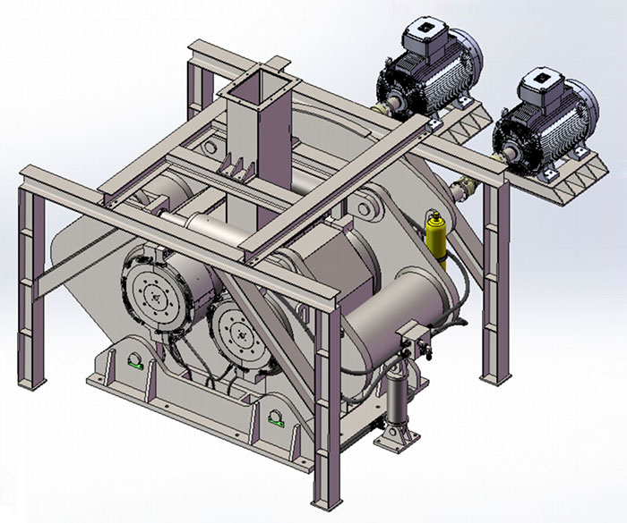

The roll surface of the roller crusher is smooth, whereas, the tooth crusher’s roll surface has dentations. These two types of roller crusher have great difference on their performance. Below is the demonstration of their difference.

##Structural Differences##
----------------------

1. Roller crusher composed of two compressing roller that runs at the same direction with the same pace. One is fixed roll, another one is movable. Material falls above from the two rollers and brings into the inter-space of the two rollers. The material received 50-200Mpa high pressure and discharged with ideal granularity from the button of the machine. The material receives pressure when goes into the roller, and the pressing force is increasing gradually. Despite some portion of power-shape material, the rest of the granulate shape material has cracks from inner. During further crushing procedure, it can largely reduce the energy consumption for grinding.
2. Toothed plate of toothed roller crusher is made of high wear-resistance alloy material, which greatly prolongs crusher’s service life. It increases tooth height and distance on the basis of original crusher that greatly improve the crumbliness of discharge granularity. A baffle is added in the material bin to make the materials uniformly distributing along the roller. The main shaft applied advanced quenching technology which enhances its strength, stiffness and wear degree.

##Material suitability##
--------------------

1. For material with hard and strong corrosion resistant properties, first choose roller with smooth surface. Since the smooth roller can crush and grind the material, which is suitable for the medium and fine crushing of the medium hard material.
2. When material crushed by roller with groove, the roller has the function of compressing and cutting the material that is very suitable for crispy and sticky material, the shape of the final product has even granularity. Groove shaped roller can also facilitate the material goes into the crushing chamber. When it needs comparative large crushing ratio, we usually adopts grooved roller. Toothed roller has the features of crushing splitting, cutting the material at the same time, it is suitable for the crushing of soft, low hardness and crispy sheeting materials like coal, dry clay etc. The granularity of the crushed material is even.