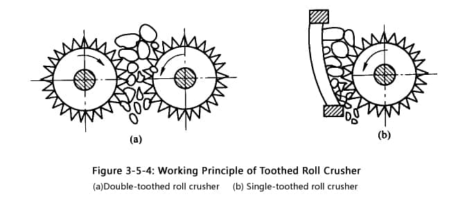
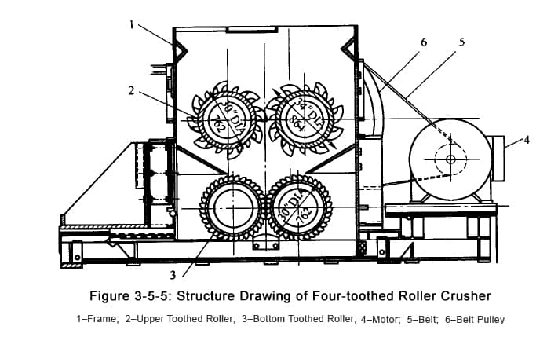

##The Type of Roll Crusher##
------------------------

The working principle of toothed roll crusher: Double-toothed roll crusher is composed of a pair of rotating toothed roller. Single-toothed crusher is composed of one rotating toothed roller and one curved crushing plate. The tooth on the roller surface can bite the coal and crush, in this way, the crushed material will discharge from the bottom with the rotation of roller.

Toothed roller crusher has the feature of low energy consumption, low over crushing, and cube shaped products. It is mainly used to crush big block of raw coal and medium coal at coal preparation plant. Due to easier damage of the roller tooth for crushing hardness materials, it is not recommended to crush the raw coal with hardness gangue. The single-toothed roll crusher is applied for primary crushing with the characteristic of large feed granularity, and the double-toothed roll crusher is mainly applied for medium crushing with higher productivity.

The four-toothed roll crusher (see figure3-5-5) developed by Luoyang Dahua connects the two sets of toothed roll crusher in series to meet different requirements from the customer. The materials discharged from the first crusher are the feeding materials for the second crusher, so it has the feature of big crushing ratio. One crusher can meet various demands of crushing granularity, where the primary and secondary crushing become one.

##Hydraulic Roll Crusher##
----------------------

The bearing of active roller in the double roll crusher is supported by a set of hydraulic device. This device works as a safety device and adjustable device to adjust the discharge opening width, in addition, it is equipped with “compensating cylinder” for ensuring the axis of active roller and fixed roller is parallel with the movement of active roller.

The fixed roller and active rolled are separately driven by two motors. The bearing of active roller is supported by double pistons and their connecting bar. Filling chlorine in the accumulator, in which the pressure is depending on the crushing force. When adjusting the discharge opening smaller, oil pump 1 inputs the oil into hydraulic cylinder through valve, and the oil on the other side of piston return to the oil tank through valve. When adjusting the opening bigger, oil will input into the cylinder through valve, and the oil on the other side of piston return to the oil tank through valve.

When the wrong crushing materials enter into the crusher, the piston force will be larger than the chlorine pressure, which moving the active roller to the left. Because the compensation cylinder is cross linked, it will ensure the axis of active roller and fixed roller is parallel with the movement of active roller.