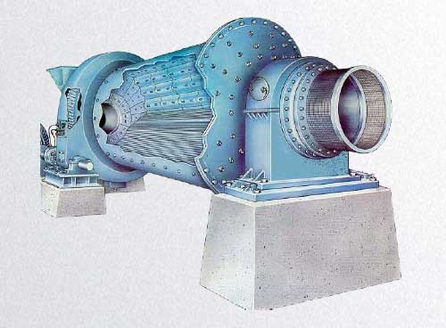

The mill is a cylinder with supporting devices at both ends, and is equipped with grinding media of different specifications. The cylinder revolves around the horizontal central axis, and the grinding medium is brought to a certain height by friction and then falls. The material passes through the cylinder continuously, and is continuously impacted, squeezed and ground by the grinding medium, and finally ground into a qualified product.

Inside the cylinder, there are some grinding media. Under the friction force and centrifugal force, the media and materials feed into the cylinder are lifted to a certain height with the cylinder rotating around the horizontal axis. If their gravity are large than the centrifugal force, the materials will drop down, and to be crushed by the impacting force. At the same time, the movement between the grinding media also has the function of grinding for the materials during the rotation process.