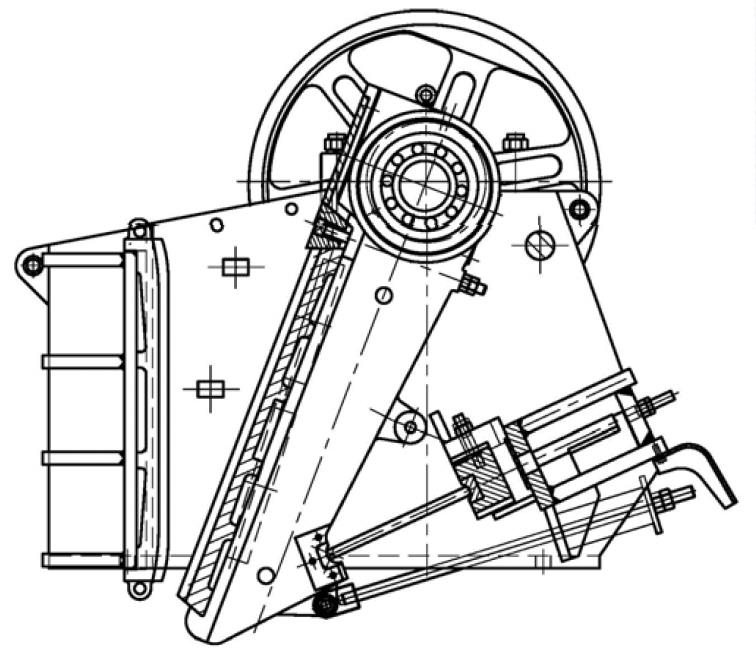

The bearing of jaw crusher is one of the more important parts of crusher, because it supports the structure of the crusher, bearing the impact of crusher crushing materials, its performance directly affects the normal operation of the equipment and production efficiency. During the operation of jaw crusher, many users found that their crusher would produce abnormal bearing heating. After operating for a period of time to return to normal, some continue for a long time, to the production of a greater impact. Bearing heating of jaw crusher refers to the bearing temperature of jaw crusher in operation or operation when the bearing temperature is overheated or higher than that of normal jaw crusher. This phenomenon is defined as bearing heating of jaw crusher, which is one of the common faults of jaw crusher.

Let’s analyze the causes of abnormal heating of the jaw broken bearing:
-----------------------------------------------------------------------

1. **Bearings are severely worn or the cage is damaged.**  
  Once the bearing wears, over time, the bearing’s inner ring, outer ring, rolling body, cage and other dimensions change, the bearing clearance increases, the accuracy of the operation decreases, which causes the temperature of the bearing to increase, vibration, noise, and serious This can cause heat generation, increased vibration, burned bearings and even shaft bending.
2. **The bearing quality is poor; the original clearance is too small.**  
  If the bearing clearance does not reach the specified value, the clearance after installation will be too small, which will cause the bearing to heat up during operation and the temperature will gradually rise.
3. **The axial positioning of the bearing is wrong.**  
  Once there is a problem with the axial positioning of the bearing, the labyrinth ring or bearing gland is not installed in place, and the eccentric axial side moves during operation, which reduces the bearing clearance and causes the bearing to heat up.
4. **The machining error of the movable jaw bearing hole is large.**  
  The bearing hole machining error is large, and the coaxiality exceeds the allowable value, resulting in a large coaxiality error of the outer ring of the bearing after the two-disc movable jaw bearing is installed, which will cause the clearance to become smaller and the bearing to heat up.
5. **There was a problem with the spindle machining.**  
  The coaxial coaxiality error of the bearings mounted on the two sides of the main shaft is too large and exceeds the allowable value of the design. In this way, the coaxiality error of the inner ring is too large after the bearings at both ends are installed, resulting in small clearance and bearing heating.
6. **The axial movement of the tightening bushing occurs.**  
  At this time, the bearing cover on the frame should be removed, the adapter sleeve should be locked, and the flywheel or sheave should be removed, and a new adapter sleeve should be replaced.
7. **The oil hole is block; the bearing is cut off, too little oil or too much oil.**  
  These will cause the bearing temperature to rise and cause abnormalities. When the equipment is running, read the instructions carefully, and refuel in time according to the instructions.
8. **The precision of parts processing cannot meet the requirements.**  
  The processing accuracy of equipment parts and components cannot meet the requirements, especially the processing accuracy of the bearing seat, which is also an important factor. The processing of the bearing seat hole must ensure the tolerance, roughness and cylindricality of the hole. If the hole tolerance is too small, the bearing clearance will be too small during the fit, and if the hole tolerance is too large, the fit will become loose. Both conditions will cause the bearing to heat up.
9. **Improper selection of lubricant.**  
  The bearing lubricant should be selected according to the bearing operating temperature, speed index, load characteristics, lubrication method and other factors. If the lubricant is improperly selected, the viscosity is too low or too high, it is difficult to form an oil film, and the heat generated during bearing operation cannot be taken away, causing Bearings are hot.

The above is the reason why the bearings of the jaw crusher are hot. When encountering these problems, you can contact the manufacturer to find repair methods and replace the bearings if necessary. When the jaw crusher bearing has abnormal heat, it must stop working in time to find out the cause, eliminate the fault, avoid bearing damage and stop the production line, causing unnecessary losses.